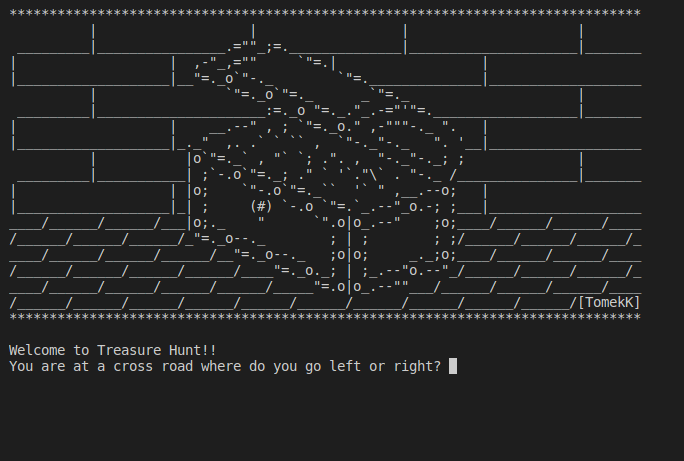

# Day3

## Lessons learned today

- Conditional Statements
```
if elif and else
```
- Logical operators
```
>, >= <, <= and, or, not
```

- Code blocks and scopes


## Project to solidify material learned 

### Treasure Hunt:
> This is a mini game that enables you to find a hidden treasure based on the choices you make. Have a go and see how if you can find it!

#### Preview:



## How to run this on your device

- Clone this repository
```
git clone https://github.com/kingdreamerr/Day3_Treasure_Hunt.git
```
- cd into the repo
```
cd Day3_Treasure_Hunt
```

- Paste the following in the terminal 
```
python3 main.py
```